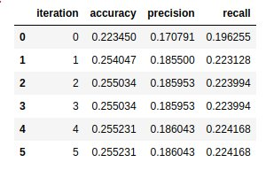
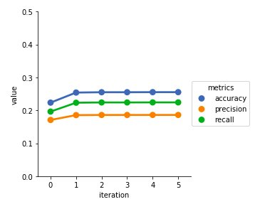
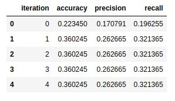
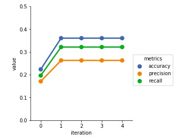

# Propagación de sentimiento con técnicas semi-supervisadas

## 1. Introducción
El aprendizaje semi-supervisado es una clase de técnicas de aprendizaje automático que utiliza datos de entrenamiento tanto etiquetados como no etiquetados. Es muy útil cuando tenemos una pequeña cantidad de datos etiquetados junto a una gran cantidad de datos no etiquetados. 

En este proyecto se busca evaluar tres técnicas semi-supervisadas. Cada una toma como dato de entrada un lexicón etiquetado con sentimiento y busca aumentar este mediante self-learning. Luego, se testean con un clasificador en un corpus anotado de twitter con sentimiento y se evalua la performance de cada una de las técnicas en las distintas iteraciones.

Todo el código del proyecto se encuentra online en el siguiente [repositorio](https://github.com/karenhaag/final-project-for-text-mining)

## 2. Corpus
Se utilizaron tres corpus: 
1. Lexicón en español

    Se trata de un corpus en formato XML de 11.383 palabras anotadas con sentimiento positivo o negativo. Cada palabra viene acompañada de una estimación numérica de su polaridad (entre -1.0 y 1.0) así como de un valor de desviación de dicha polaridad. 
    El lexicón puede descargarse desde [aqui](http://timm.ujaen.es/recursos/ml-senticon/).

2. Corpus de twitter no anotado

    El corpus cuenta con 60798 tweets en español. Por cada tweet el corpus cuenta con: el id del tweet, el usuario que lo generó, el texto del tweet, la fecha y el lenguaje (en este caso "es"). Este corpus está en formato XML y lo puede encontrar en el siguiente [enlace](https://github.com/imendibo/SEPLN-TASS15/tree/master/DATA) con el nombre "general-tweets-test.xml".

3. Corpus de twitter anotado

    Este corpus cuenta con 7219 tweets en español. Cada tweet del corpus cuenta con el id del tweet, el usuario que lo generó, el texto del tweet, la fecha y el lenguaje (en este caso "es"), el sentimiento (P, P+ para positivos; N,N+ para negativos; NEU para neutro y NONE si no tiene polaridad asignada), y el tema al que pertenece(política, deporte, entretenimiento, etc). Este corpus está en formato XML puede encontrar en el siguiente [enlace](https://github.com/imendibo/SEPLN-TASS15/tree/master/DATA) con el nombre "general-tweets-train-tagged.xml".
    

## 3. Preprocesamiento del corpus

Los tres corpus utilizados se encuentran en formato XML. Para poder procesarlos se utilizó la librería [Element Tree](https://docs.python.org/2/library/xml.etree.elementtree.html) de Python que permite iterar fácilmente en los elementos del documento.

1. ### Pre-procesamiento del lexicón:

    Para esta tarea creamos un diccionario del lexicón utilizando las palabras del corpus como keys del diccionario y dándole como valor su polaridad asociada(valor entre -1 y 0 si es negativa, valor entre 0 y 1 si es positiva). 

    Ocurrió que hubo una pequeña cantidad de palabras que se encontraban en el lexicón tanto con polaridad positiva como negativa. En primera instancia se intentó obtener su polaridad fraccionando el corpus anotado y utilizando una parte de este para saber si aparecían con mas frecuencia en oraciones positivas o negativas y así poder desambiguarlas. Esto no ayudó mucho ya que el corpus utilizado era pequeño y algunas palabras no ocurrían en el corpus o aparecían pocas veces, lo cual no nos permitía asignarles valor de forma precisa. Para solucionar esto, se decidió asignarles a tales palabras la polaridad con la que más fuertemente estaban asociadas según su peso.

2. ### Pre-procesamiento de tweets:

    Se obtuvo la lista de tweets y polaridad asociada del corpus anotado. Del corpus no anotado solo se obtuvo la lista de tweets.
    Luego se les aplicó a ambas listas de tweet el mismo proceso de tokenización y limpieza. 
    - ### Tokenización y limpieza de corpus: 
        Se dividió cada tweet en lista de palabras. Luego se necesita "limpiar" el corpus de palabras que no sean significativas para el análisis. Por ejemplo palabras que no estén en el lenguaje español, o que ocurran muchas veces como es el caso de los pronombres, preposiciones, etc.
         Los tweets en particular no son listas simples de palabras en español, si no que también pueden tener: mensiones a otros usuarios, los cuales se identifican con "@nombredeusuario"; Hashtags, los cuales se identifican como "#tag" y enlaces los cuales tienen en su contenido la sigla "http". Por lo tanto se decidió eliminar toda aparición de estos elementos del corpus. También signos de puntuación y stopwords (artículos, preposiciones, conjunciones, pronombres, etc). Para las stopwords se tuvo en cuenta que sólo se eliminen aquellas que no se encuentren en el lexicón, ya sea en el original o en el aumentado que se va generando en las distintas iteraciones de las diferentes técnicas de propagación. Hablaremos con más detalle de los lexicones aumentados más adelante.

## 4. Vectorización de tweets y reducción de dimensionalidad
Después de obtener el pre-procesado del corpus no etiquetado lo vectorizamos para luego utilizar dicha vectorización en las diferentes técnicas de self-learning. 
Se armó una matriz de features con la librería [DictVectorizer](http://scikit-learn.org/stable/modules/generated/sklearn.feature_extraction.DictVectorizer.html) de Scikit Learn la cual construye una matriz de dimensionalidad [n_samples, k_features]  n son las filas en las cuales están asociadas a cada una de las palabras que se encuentran en el vocabulario del corpus y k son las palabras semillas (que se encuentran en el lexicón) con las que co-ocurren las palabras del vocabulario. Entonces en la celda[i,j] de la matriz se encuentra el número de veces que ocurre la palabra i con la palabra j en un contexto de ventana = 1.
Luego del armado de la matriz se prosiguió en reducir su dimensionalidad. Se sacaron de ésta las palabras que ocurrían en menos de "C" contextos, donde "C" es el promedio de contextos en la que se encuentran las palabras del vocabulario.  

## 5.  Técnicnicas semi-supervisadas de propagación de sentimiento

Luego de obtener la vectorización del corpus no etiquetado, lo utilizamos para aprender de él en dos de las tres técnicas de propagación de sentimiento y así aumentar el lexicón original. Las tres técnicas se describen a continuación:

1. ### Selección por fuerte información mutua.
En esta técnica utilizamos la vectorización de palabras para seleccionar las palabras para agregar al lexicón. Una palabra era seleccionada como positiva (o negativa) si la probabilidad de ocurra en un contexto positivo (o negativo) era mayor a cierto porcentaje (70%, 80%, 90%). Para esto se cuenta la ocurrencia en contextos positivos(o negativo) y se divide en total de las ocurrencias de la palabra.
Para asignarle el peso a la palabra una vez que fué seleccionada como positiva o negativa, en primera instancia se utilizó parte del corpus anotado para darle polaridad con respecto a cuantas veces aparece en textos positivos o negativos la palabra y así sacar un porcentaje de esto para asignarle algún valor entre -1 y 1 según corresponda a su polaridad. Pero al igual que sucedía con el corpus del lexicon inicial, muchas palabras no aparecían en el corpus anotado o ocurrían pocas veces. Por lo tanto se decidió binarizar los valores asignandole -1 a palabras negativas y 1 a palabras positivas.

Luego de tener las nuevas palabras en el lexicón se vuelve a iterar con el lexicón aumentado.

2. ### Selección por votación
Esta técnica utiliza solo el corpus pre-procesado. Le asigna clase positiva o negativa usando un clasificador que dado un tweet realiza un conteo de polaridad de sus palabras y le asigna un valor. Este clasificador se ve más adelante en detalle. Si un tweet es asiganado como positivo (o negativo) por el clasificador, todas las palabras que se encuentran en el tweet son asignadas como positivas con valor 1 (o negativas con valor -1). Si un tweet no tiene ninguna palabra positiva ni negativa, lo descartamos como ejemplo de aprendizaje.
Si una palabra ha sido asignada a ambas clases, le asigno un valor contínuo entre 1 y -1 que según la proporción de veces que ocurrió en tweets positivos o negativos utilizando para esto parte del corpus anotado. Si no ocurría en el corpus, la descartamos.

Luego volvemos a iterar con el lexicón aumentado.

3. ### Propagación de sentimiento mediante grafos
Para esta técnica se utilizó la librería [Label Propagation](http://scikit-learn.org/stable/modules/generated/sklearn.semi_supervised.LabelPropagation.html#sklearn.semi_supervised.LabelPropagation) de Scikit Learn.  En la cual el algoritmo toma como entrada dos matrices densas. La primera es de la forma [n_samples, k_features] en la cual cada fila tiene la vectorización de los ejemplos de entrenamiento. Y la segunda matriz es un vector [n_labels] el cual contiene la clase a la que pertenece cada palabra. Por defecto las palabras no etiquetadas, a las que le queremos propagar sentimiento deben tener en su celda correspondiente en el vector el valor -1. Por lo tanto a las palabras etiquetadas con valor negativo le asignamos el valor 0 en el vector de labels y a las asignadas con valor positivo le asignamos el valor 1. Para la matriz de features utilizamos la descripta en la sección 4.
Al final de la propagación agregamos al lexicón las nuevas palabras asociadas a alguna de las dos clases y volvemos a iterar.

## 6. Clasificador
Construímos un clasificador por votación. Dado un tweet y un lexicón(lexicón inicial o aumentado con alguna de las técnicas) el clasificador inicia un conteo en el cual cuenta la cantidad de palabras positivas y la cantidad de palabras negativas y le asigna la polaridad asociada a la clase mayoritaria.

## 7. Evaluación

Utilizamos el clasificador con los diferentes lexicones generados en cada iteración de las tres técnicas nombradas anteriormente para clasificar los tweets del corpus anotado. Medimos acuracy, precision y recall de cada una de las iteraciones. 
Obtuvimos los siguientes resultados:

### 1. Evaluación de selección por fuerte información mutua

La iteración 0 es el recultado de utilizar el clasificador con el lexicón inicial y cada iteración muestra como va cambiando el accuracy, precision y recall a medida que aumenta el lexicón. Podemos ver que solo aumenta aproximadamente 0.03 el accuracy, el recall 0.02 y la precisión solo 0.01 en la primera iteración. En las próximas iteraciones no aumenta mucho y luego de la cuarta iteración se estanca.

Cada una de las métricas de esta propagación se puede apreciar mejor en el siguiente gráfico:

### Accuracy, presicion and recall técnica 1:

### 2. Evaluación de selección por votación

La iteración 0 es el recultado de utilizar el clasificador con el lexicón inicial y cada iteración muestra como va cambiando el accuracy, precision y recall a medida que aumenta el lexicón. Podemos ver que en esta técnica las metricas mejoran mucho ya que el accuracy aumenta en la primera iteración casi 0.14 puntos, la precision 0.09 y el recall 0.125 puntos. Las metricas no cambian a medida que pasan las iteraciones, esto se debe dar por que al agregar todas las palabras al lexicón de los tweets clasificados, no debe aprender nuevas palabras o debe ser muy chico el aprendizaje en la segunda iteración y en las siguientes nula.

Cada una de las métricas de esta propagación se puede apreciar mejor en el siguiente gráfico:

### Accuracy, presicion and recall técnica 2:

### 3. Evaluación de propagacion por grafos:

No pudimos obtener resultados significativos mediante esta tecnica posiblemente por falta de datos, ya que el algoritmo no llega a converger o poco entendimiento de la librería. El algoritmo solo tendía a cambiar los labels de aquellos datos que estaban ya etiquetados y solo propagaba en muy pocos datos sin etiquetar. Queda como trabajo a futuro conseguir resultados y poder compararlos con las anteriores técnicas.

## 8. Conclusión.
Dado que no pudimos obtener buenos resultados en el grafo de propagación no podemos sacar buenas conclusiones sobre este algoritmo. Con respecto a la técnica 3, sorprendió como tenía una mejor performance con respecto a la tecnica 2. Sin embargo este comportamiento puede estar ligado solo al corpus de entrenamiento con el que se trabajó. A pesar de esto posiblemente la técnica 3 no tiende  a mejorar a lo largo de las iteraciones, dado que aumenta mucho el tamaño del lexicón y en las siguientes iteraciones no puede aprender de nuevos ejemplos (ya que ya los aprendió) y seguramente se comporte de la misma manera sin importar el corpus con el que se lo entrene. En cambio la tecnica 2 aunque no mejore mucho en las iteraciones, puede que ajustando diferentes parámetros pueda aprender mejor, como por ejemplo la reduccion de dimensionalidad.

## 9. Trabajo futuro

- Indagar más sobre la técnica de propagación por grafos, cambiar métricas para obterner mejores resultados.
- Utilizar diferentes corpus. Aplicar las técnicas en corpus en inglés en los cuales talvez se pueden conseguir corpus más grandes con los cuales obtener mejores resultados.
- Investigar y aplicar nuevas técnicas de self-learning.
- Propagar sentimientos a los hashtag para evaluar tópicos en twitter.
